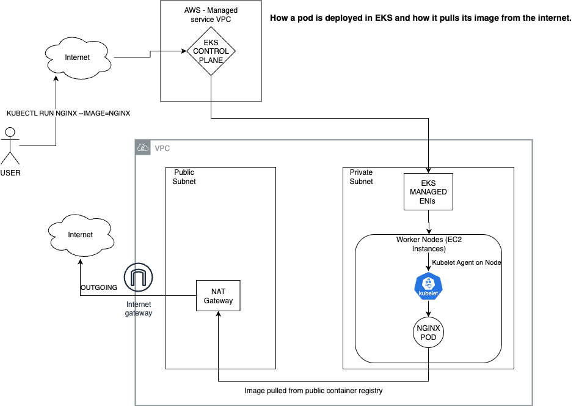

# 🚀 GitOps Platform: ThriveAI

## 💡 Project Purpose

Diagram picture of the eks workflow 


This repository demonstrates a GitOps-driven Kubernetes platform on AWS EKS for consistent, repeatable deployments.

CI (GitHub Actions): builds Docker images (tagged with commit SHA), runs SonarCloud + Trivy scans, pushes to Amazon ECR, updates Kustomize overlays (image tags), and commits a bump branch.

CD (ArgoCD, App-of-Apps): continuously syncs the envs/dev Kustomize tree into the cluster, deploying frontend, backend, monitoring, and cert-manager apps.

Monitoring: Grafana & Prometheus deployed via ArgoCD with Helm values stored in Git.

TLS & DNS: cert-manager issues Let’s Encrypt certs via DNS01 challenge; Cloudflare provides DNS (manual setup now, automation planned).

Secrets: currently created manually for demo; to be migrated to SealedSecrets or ExternalSecrets for production.

Underlying infra (EKS, IAM, networking, ALBs) is provisioned via Terraform (see [infra repo](https://github.com/Hanz-ala1/eks-platform-lab))

## 🗺️ EKS Pod Deployment: Background

Before diving into the GitOps setup, here’s a simplified view of how a pod is deployed in EKS when you run a command like: 





---

## 🧠 What You'll Learn / Practice

| Task | What You'll Learn |
|------|-------------------|
| 🔄 Automate cert-manager secrets via Sealed Secrets | Secure secret management in GitOps |
| 📦 Deploy apps via HelmRelease + Values overrides | Helm + GitOps + Kustomize |
| 🌐 Automate DNS with ExternalDNS | Dynamic DNS updates with Cloudflare |
| 🔍 Add Prometheus/Grafana | Kubernetes Observability |
| 🚀 CI/CD via GitHub Actions | GitOps CI Pipelines |
| 🔐 Rotate Let’s Encrypt certs | TLS lifecycle automation with alerts |

---

## 🌐 Domain Setup

- **Domain:** `thriveai.website`
- **DNS Provider:** Cloudflare
- **Subdomain for App:** `myapp.thriveai.website`
- **Subdomain for Grafana:** `grafana.thriveai.website`
- **DNS Validation:** via `DNS01` challenge through cert-manager

---

## 🧱 Stack Overview

- ✅ Kubernetes (EKS)
- ✅ ArgoCD (CD)
- ✅ Grafana
- ✅ Prometheus
- ✅ Github Actions (CI)
- ✅ cert-manager + ClusterIssuer
- ✅ Cloudflare DNS (via token)
- ✅ NGINX Ingress Controller
- ✅ Kustomize (base + overlays)
- ✅ Let’s Encrypt (DNS01 challenge)

---

## 📁 Folder Structure

```text
├── .github/                   # Github Actions CI For frontend and backend
├── apps
│   ├── backend/               # Base and overlay Kustomize for backend app
│   ├── frontend/              # Same structure for frontend
│   ├── monitoring/            # Grafana & Prometheus
│   └── cert-manager/          # Helm-based cert-manager deployment + ClusterIssuer patch
├── bootstrap/
│   └── root-app.yaml          # App of Apps manifest
├── envs/
│   ├── dev/                   # Kustomization that drives the ArgoCD App tree
│   └── prod/                  # Placeholder for future promotion
├── clean_up.sh                # Deletes AWS resources that interfere with Terraform destroy
├── set_up.sh                  # Helper script to re-apply cluster setup quickly
└── README.md
```

---

## ⚙️ CI / CD (GitHub Actions → ECR → ArgoCD)

High level:
- GitHub Actions builds frontend & backend Docker images when files under `apps/frontend/**` or `apps/backend/**` change.
- Images are tagged with the commit SHA.
- The workflow uses `kustomize edit set image ...` to update `apps/*/overlays/dev/kustomization.yaml`.
- A bump branch (example: `ci/image-bump-<sha>`) is created and pushed. ArgoCD will pick up the change when the bump branch is merged or when the root-app target revision is updated.

Key files:
- `.github/workflows/frontend.yaml` (frontend build/test/push + kustomize patch)
- `.github/workflows/backend.yaml` (backend)
- Note: workflow supports `workflow_dispatch` for manual runs.

Developer commands:
```bash
# Manually trigger from CLI (GitHub CLI)
gh workflow run "Build, Push to ECR & Patch Kustomization" --ref feature/your-branch
# Or in GitHub UI Actions -> run workflow (select branch)


## ⚙️ Workflow (GitOps with ArgoCD)

To bootstrap the GitOps platform:

```bash
kubectl apply -f bootstrap/root-app.yaml
```

This triggers ArgoCD to:

1. Clone the Git repo (this one), targeting the `envs/dev/` path.
2. Apply the Kustomize tree from `envs/dev/kustomization.yaml`.
3. Which recursively deploys:
   - `apps/backend/overlays/dev`
   - `apps/frontend/overlays/dev`
   - `apps/cert-manager/overlays/dev` (including Helm chart installation)
   - `apps/monitoring/overlays/dev` (including Helm chart installation)

---


## 🔐 Secrets Setup
GitHub Actions (CI)
AWS_ACCESS_KEY_ID / AWS_SECRET_ACCESS_KEY

GH_PAT (Personal Access Token for bump branch commits)

SONAR_TOKEN (SonarCloud scan)

AWS ECR 


Kubernetes (CD)
These secrets are **not committed**. They must be created manually (or automated later via Sealed Secrets or External Secrets):

```bash
kubectl -n cert-manager create secret generic cloudflare-api-token-secret --from-literal=mykey=cloudflare-api-token

kubectl create secret generic grafana-admin --from-literal=admin-user=admin  --from-literal=admin-password=createapassword -n monitoring


```

This is required to allow cert-manager to validate your domain with Let’s Encrypt using the DNS01 challenge.

---

## Monitoring
```markdown
### Grafana / Helm values note
- Initially we embedded Helm `values:` inline in the ArgoCD Application spec for quick testing. To make it better and easier to read, we moved values to `apps/monitoring/base/values.yaml`.
- ArgoCD cannot automatically use a values YAML in your Git repo for a remote chart unless configured as a second source. We solved this using ArgoCD **multiple sources**: one source for the vendor Helm chart (chart repo), and one source (with `ref:`) pointing to this Git repo where the `values.yaml` lives — referenced as `$<ref>/path/to/values.yaml`.
- This keeps the upstream chart clean and our overrides versioned in Git.

## 🐛 Troubleshooting

| Issue                        | Solution                                                      |
|-----------------------------|---------------------------------------------------------------|
| `ERR_TOO_MANY_REDIRECTS`    | Check NGINX ingress annotations + Cloudflare SSL mode        |
| Certs not issued            | Confirm ClusterIssuer exists, secret exists, DNS propagates   |
| `Error 1016: Origin DNS`    | ELB changed → update Cloudflare A record                      |
| ArgoCD App stuck            | Check `argocd app logs <app>` or inspect Kustomize path       |

---

## 🛠 Manual Steps (for now)

### `set_up.sh`
Automates initial cluster setup commands (after Terraform apply). Helps quickly re-provision during iterative testing.

### `clean_up.sh`
Force-deletes AWS resources (e.g., LoadBalancers, PVs) that sometimes prevent `terraform destroy` from succeeding.

---

## 📌 Next Improvements (Roadmap)

- [ ] CI Pipeline via GitHub Actions (lint)
- [ ] Integrate AWS Secrets Manager
- [ ] Setup Sealed Secrets / External Secrets for GitOps-safe secret storage
- [ ] Add Monitoring Stack (Prometheus, Grafana, AlertManager)
- [ ] Enable Prod environment deployment (`envs/prod`)

---

## 🤝 Contributions

This repo is intended to demonstrate real-world GitOps implementation practices and serve as a learning reference. Feedback welcome!

---

## 🧠 Why This Matters 

This project demonstrates:

- Infrastructure as Code (Terraform)
- GitOps Lifecycle Management (ArgoCD)
- Secrets Management and TLS Automation
- Working with production-grade practices (DNS, cert rotation, CI/CD)
- Clean Git structure for modularity, environment promotion, and reusability


